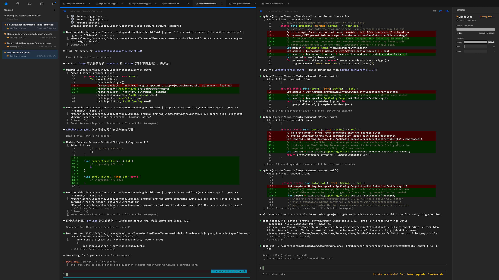

<p align="center">
  <picture>
    <source media="(prefers-color-scheme: dark)" srcset="assets/logo-dark.png">
    <source media="(prefers-color-scheme: light)" srcset="assets/logo-light.png">
    
  </picture>
  <br>
  <code>/ter-MU-ra/</code>
  <br><br>
  A native macOS terminal built for power users of AI coding tools (Claude Code, Codex, Aider, etc.).<br>
  No login required. Lightweight. Open Core.
  <br><br>
  <a href="https://github.com/leeronzhang/termura/releases/latest/download/Termura-v0.2.0-universal.dmg"><strong>Download latest release (macOS Universal)</strong></a> · <a href="https://github.com/leeronzhang/termura/releases">All releases</a>
  <br><br>
  <a href="#termura-中文">中文版</a>
</p>

<p align="center">
  
</p>

---

## Features

### Terminal & Sessions

- GPU-accelerated terminal rendering via [libghostty](https://github.com/ghostty-org/ghostty) (Metal)
- Multi-session management with sidebar navigation
- Session persistence across app restarts (GRDB/SQLite)
- Session branching — create alternative exploration branches, merge back with summaries
- Session export to HTML or JSON
- Full-text search (FTS5) across sessions and notes
- Visor mode (global hotkey drop-down terminal)

### Dual-Pane Mode

- Side-by-side terminals for parallel operations
- Independent scrolling per pane
- Drag sessions between panes
- Focus indicator with blue accent line

### AI Agent Integration

- Auto-detects running AI agents: Claude Code, Codex, Aider, OpenCode, Gemini, Pi
- Real-time agent status tracking (idle, thinking, tool execution, waiting, error, completed)
- Token counting and cost estimation parsed from agent output
- Context window monitoring with visual progress bar
- Risk detection — alerts for high-risk agent operations (file deletion, destructive commands)
- Agent resume support with pre-filled launch commands

### Editor-grade Composer

- NSTextView/TextKit 2 powered input field
- Click-to-position cursor, multi-line editing
- Word-level navigation and selection
- Input history (Cmd+Up/Down)
- File attachments for AI agent context
- Auto-save of unsent text

### Tabs & Content Types

- Terminal tabs, split tabs, note tabs, file tabs, diff tabs, preview tabs
- Tab persistence across restarts
- Double-click to rename

### Sidebar

- **Sessions** — session list, inline rename, context menu, agent status badges
- **Agents** — multi-agent dashboard across all sessions, "needs attention" highlighting
- **Notes** — markdown notes list with search
- **Project** — file tree with git integration, branch/commit display, changed file stats, staged/unstaged toggle, problems panel

### Markdown Notes

- Capture terminal output to notes
- Full markdown editor in tabs
- Auto-save with debounce
- Full-text search integration

### Project Integration

- Git status: branch, commit hash, ahead/behind, remote host detection
- File tree with git status icons
- Staged vs working tree diffs
- File editing with syntax highlighting (120+ languages via Highlightr)
- QuickLook preview for images, PDFs, Office documents
- Problems/diagnostics panel

### Shell Integration

- OSC 133 protocol for structured output (prompt, command, execution, exit code markers)
- One-click shell hook installation (bash, zsh)

### Appearance

- Theme system with design tokens
- Multiple bundled themes with import support
- Font customization (family + size)
- Dark mode support

### Remote Control (Mac side)

- iOS companion app pairs with Mac over LAN (Bonjour + WebSocket) and falls back to CloudKit-mailbox transport for cross-network reach
- Built-in LaunchAgent helper keeps the bridge alive when Termura.app isn't in the foreground (installed on first pairing, opt-in)
- Identity / paired-device records persist in macOS Keychain so iPhones survive Mac restarts
- 256 KB-capped command-boundary snapshots (no streaming PTY); oversized output spills into CKAsset attachments
- Per-device revocation + global "wipe all pairings" reset; agent process state can be wiped over XPC
- The iOS app itself ships from a separate paid-IAP repository; the Mac side is fully open-source

### Privacy

- Zero telemetry, zero login, fully offline by default
- All data stored locally in `~/.termura/`; remote-control transport opt-in per device, traffic stays in your iCloud private DB or your LAN
- No network transmission of user data outside the explicit remote-control flow

## Tech Stack

| Component | Technology |
|-----------|-----------|
| UI | SwiftUI + AppKit |
| Terminal | [libghostty](https://github.com/ghostty-org/ghostty) (Metal GPU rendering) |
| Syntax Highlighting | [Highlightr](https://github.com/raspu/Highlightr) |
| Database | [GRDB](https://github.com/groue/GRDB.swift) (SQLite + FTS5) |
| Shortcuts | [KeyboardShortcuts](https://github.com/sindresorhus/KeyboardShortcuts) |
| Collections | [Swift Collections](https://github.com/apple/swift-collections) |
| Remote wire protocol | `Packages/TermuraRemoteKit` (Protocol / Server / Client) — in-tree SPM |
| XPC interfaces | `Packages/AgentXPCInterfaces` — ObjC clang module for the agent ↔ app bridge |
| LaunchAgent helper | `Packages/LaunchAgent` — SPM executable `termura-remote-agent` |
| Build | XcodeGen + Swift 6.0 |

## Getting Started

### Requirements

- macOS 14.0+
- Xcode 16+
- [XcodeGen](https://github.com/yonaskolb/XcodeGen)

### Build

```bash
# Create your machine-local signing config from the template
cp project.yml.example project.yml

# Replace DEVELOPMENT_TEAM with the team that owns your Apple Development cert,
# then verify the match before generating the project
bash scripts/check-signing-setup.sh

# Generate Xcode project
xcodegen generate

# Build
xcodebuild -scheme Termura -configuration Debug build
```

### Development

```bash
# Lint
swiftlint lint --strict

# Format
swiftformat Sources/ --verbose
```

## Roadmap

Phase 1-3 (terminal core, shell integration, editor input, output chunking, notes, search) — done.

Phase 4 (dual-pane, agent dashboard, session branching, project integration) — in progress.

Next up: plugin system, custom workflows, advanced session analytics.

## Contributing

Contributions are welcome! Please read the project guidelines before submitting a PR.

## License

[Apache License 2.0](LICENSE) — see [LICENSE](LICENSE) for details.

---

<a id="termura-中文"></a>

<p align="center">
  <picture>
    <source media="(prefers-color-scheme: dark)" srcset="assets/logo-dark.png">
    <source media="(prefers-color-scheme: light)" srcset="assets/logo-light.png">
    
  </picture>
  <br>
  <code>/ter-MU-ra/</code>
  <br><br>
  一款为 AI 编程工具（Claude Code、Codex、Aider 等）深度用户打造的原生 macOS 终端。<br>
  无需登录，轻量级，Open Core 开源。
  <br><br>
  <a href="https://github.com/leeronzhang/termura/releases/latest/download/Termura-v0.2.0-universal.dmg"><strong>下载最新版本 (macOS 通用版)</strong></a> · <a href="https://github.com/leeronzhang/termura/releases">所有版本</a>
</p>

## 功能特性

### 终端与会话管理

- 基于 [libghostty](https://github.com/ghostty-org/ghostty) 的 GPU 加速终端渲染（Metal）
- 侧边栏多会话管理
- 会话跨重启持久化（GRDB/SQLite）
- 会话分支 — 从任意节点创建探索分支，完成后可合并回主线
- 会话导出为 HTML 或 JSON
- 全文搜索（FTS5），覆盖会话和笔记
- Visor 模式（全局快捷键下拉终端）

### 双面板模式

- 并排终端，适用于并行操作
- 各面板独立滚动
- 拖拽会话到不同面板
- 蓝色高亮指示当前聚焦面板

### AI Agent 集成

- 自动检测运行中的 AI Agent：Claude Code、Codex、Aider、OpenCode、Gemini、Pi
- 实时 Agent 状态追踪（空闲、思考中、工具执行、等待输入、错误、已完成）
- 从 Agent 输出中解析 Token 计数和费用估算
- 上下文窗口监控，带可视化进度条
- 风险检测 — 对高风险 Agent 操作（文件删除、破坏性命令）发出警告
- Agent 恢复支持，预填充启动命令

### 编辑器级输入组件

- 基于 NSTextView/TextKit 2 的输入区域
- 点击定位光标、多行编辑
- 词级导航和选择
- 输入历史（Cmd+Up/Down）
- 文件附件，为 AI Agent 提供上下文
- 未发送文本自动保存

### 标签页与内容类型

- 终端标签、分屏标签、笔记标签、文件标签、Diff 标签、预览标签
- 标签页跨重启持久化
- 双击标签标题可重命名

### 侧边栏

- **会话** — 会话列表、内联重命名、右键菜单、Agent 状态徽章
- **Agents** — 跨所有会话的多 Agent 仪表盘，"需要关注"高亮提示
- **笔记** — Markdown 笔记列表，支持搜索
- **项目** — 文件树（含 Git 集成）、分支/提交显示、变更文件统计、暂存区/工作区切换、问题面板

### Markdown 笔记

- 捕获终端输出到笔记
- 标签页内完整 Markdown 编辑器
- 自动保存（带防抖）
- 全文搜索集成

### 项目集成

- Git 状态：分支名、提交哈希、领先/落后提交数、远程仓库检测
- 带 Git 状态图标的文件树
- 暂存区 vs 工作区 Diff 查看
- 文件编辑，支持语法高亮（Highlightr 支持 120+ 语言）
- QuickLook 预览图片、PDF、Office 文档
- 问题/诊断面板

### Shell 集成

- OSC 133 协议实现结构化输出（提示符、命令、执行、退出码标记）
- 一键安装 Shell Hook（bash、zsh）

### 外观

- 设计令牌系统的主题引擎
- 多套内置主题，支持导入自定义主题
- 字体自定义（字体族 + 字号）
- 深色模式支持

### 远程控制（Mac 端）

- iOS 伴侣 app 通过 LAN（Bonjour + WebSocket）与 Mac 配对，跨网时回退到 CloudKit 信箱模式
- 内置 LaunchAgent 守护进程，Termura.app 未在前台时仍保持桥接（首次配对时引导启用，可选）
- 身份 / 已配对设备记录持久化在 macOS Keychain，Mac 重启后 iPhone 不需重新配对
- 256 KB 上限的命令边界级输出快照（**非流式 PTY**），超限自动转 CKAsset 附件
- 每设备撤销 + 全局"撤销所有配对"重置；Agent 进程状态可通过 XPC 远程清空
- iOS app 本体从独立的付费 IAP 仓库发布；Mac 端代码完全开源

### 隐私

- 默认零遥测、零登录、完全离线
- 所有数据本地存储于 `~/.termura/`；远程控制传输按设备 opt-in，流量留在你自己的 iCloud 私有库或局域网
- 除显式启用的远程控制外，不进行任何用户数据的网络传输

## 技术栈

| 组件 | 技术 |
|------|------|
| UI | SwiftUI + AppKit |
| 终端 | [libghostty](https://github.com/ghostty-org/ghostty)（Metal GPU 渲染） |
| 语法高亮 | [Highlightr](https://github.com/raspu/Highlightr) |
| 数据库 | [GRDB](https://github.com/groue/GRDB.swift)（SQLite + FTS5） |
| 快捷键 | [KeyboardShortcuts](https://github.com/sindresorhus/KeyboardShortcuts) |
| 集合类型 | [Swift Collections](https://github.com/apple/swift-collections) |
| 远程协议 | `Packages/TermuraRemoteKit`（Protocol / Server / Client，仓内 SPM） |
| XPC 接口 | `Packages/AgentXPCInterfaces` — Agent ↔ App 桥接的 ObjC clang module |
| LaunchAgent | `Packages/LaunchAgent` — SPM 可执行 `termura-remote-agent` |
| 构建 | XcodeGen + Swift 6.0 |

## 快速开始

### 环境要求

- macOS 14.0+
- Xcode 16+
- [XcodeGen](https://github.com/yonaskolb/XcodeGen)

### 构建

```bash
# 从模板生成机器本地签名配置
cp project.yml.example project.yml

# 把 DEVELOPMENT_TEAM 改成你本机 Apple Development 证书所属的团队，
# 生成项目之前先做一次校验
bash scripts/check-signing-setup.sh

# 生成 Xcode 项目
xcodegen generate

# 构建
xcodebuild -scheme Termura -configuration Debug build
```

### 开发

```bash
# 代码检查
swiftlint lint --strict

# 代码格式化
swiftformat Sources/ --verbose
```

## 路线图

Phase 1-3（终端核心、Shell 集成、编辑器输入、输出分块、笔记、搜索）— 已完成。

Phase 4（双面板、Agent 仪表盘、会话分支、项目集成）— 进行中。

后续计划：插件系统、自定义工作流、高级会话分析。

## 贡献

欢迎贡献代码！提交 PR 前请阅读项目规范。

## 许可证

[Apache License 2.0](LICENSE) — 详见 [LICENSE](LICENSE)。
